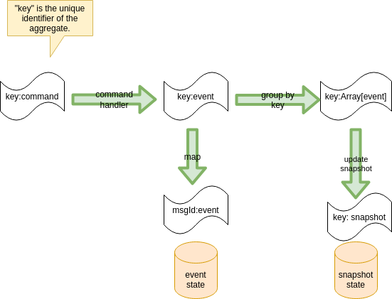
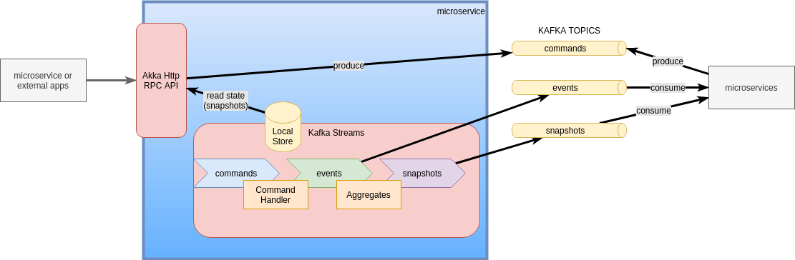

# Event Sourcing with Kafka Streams

Event driven/event sourcing microservice example written with:

- [Scala](https://scala-lang.org/)
- [Kafka Streams](https://kafka.apache.org/documentation/streams/)
    - [Kafka Streams - Interactive Queries](https://docs.confluent.io/current/streams/developer-guide/interactive-queries.html)
- [Akka Http](https://doc.akka.io/docs/akka-http/current/index.html)
- [Kaa Schema Registry](https://github.com/davideicardi/kaa)

## Patterns

- [Command Query Responsibility Segregation](https://docs.microsoft.com/en-us/azure/architecture/patterns/cqrs)
- [Event Driven](https://docs.microsoft.com/en-us/azure/architecture/guide/architecture-styles/event-driven)
- [Domain Driven Design](https://martinfowler.com/bliki/DomainDrivenDesign.html)
- [Event Sourcing](https://docs.microsoft.com/en-us/azure/architecture/patterns/event-sourcing)

## Overview

For an overview of Kafka Stream see [Streams Concepts](https://docs.confluent.io/platform/current/streams/concepts.html).

The goal of this project is to implement Event Sourcing pattern with Kafka Streams. Main concepts are:

- **commands**: topic, `KStream`
- **events**: topic, `KStream`
- **snapshots**: topic, `KTable`

**snapshots** table contains the current state of the entities, and it is created by aggregating **events** by key. **commands** are validated using the corresponding **snapshots** and transformed to **events**, that will update again the snapshots for the next command:

Group `EVENTS` stream by key and aggregate them to a `SNAPSHOTS` table.
Left join `COMMANDS` stream with the `SNAPSHOTS` table and output new `EVENTS`.




There are 3 types of topics:

- `*.commands`: Commands are an instruction, telling a system to "do something". The verb is usually the imperative mood, present tense. Expressed as: **{Verb}{Entity}**.
    - examples: `CreateBook`, `ReserveSeat`
- `*.events`: Events reflect an immutable fact. The verb is usually past-tense. Expressed as: **{Entity}{Verb}**
    - examples: `BookCreated`, `SeatReserved`
- `*.snapshots`: Snapshots reflect the current state of an entity. Expressed as: **{Entity}**
    - examples: `Book`, `Seat`

**A topic always belongs logically to a single microservice**,
this is enforced using a prefix with the name of the microservice: **{service}.{type}**. Like `books-catalog.events`.


Following **Event Driven** architecture, microservice should react to other **events** happened inside the system by subscribing to the appropriate `*.events` topic or `*.snapshots` topic. As a reaction of one of these events the microservice can produce a **command** in its own `*.commands` topic or do some other action.



Another alternative is to send a commands to the appropriate `*.commands` topic when we want to instruct another microservice to do something. **But we should avoid the situations where many microservices write in the same topic.** In these case it is better to hide the producer of the command inside an HTTP/RPC call.

**Short rules**:

- a microservice can **read** on its own topics or on all the `events` and `snapshots` topics of other services
- a microservice can **write** only on its own topics or on the `commands` topics of other services

## Examples

### Bank account

For example, to apply this pattern to a very simple bank account scenario I can have:

- `operations` stream as "commands" (requests to deposit or withdraw an amount of money, eg. "deposit $10" => `Operation(+10)` )
- `movements` stream as "events" (actual deposit or withdraw event, eg. "$10 deposited" => `Movement(+10)` )
- `account` table as a "snapshots" (account balance, eg. "there are currently $20 in my account" => `Account(20)` )
- account id is used as `key` for all topics and tables

The topology can be written like:

```scala
case class Operation(amount: Int)
case class Movement(amount: Int, error: String = "")
case class Account(balance: Int)

// events
val movementsStream = streamBuilder.stream[String, Movement](Config.topicMovements)
// snapshots
val accountTable = movementsStream
    .groupByKey
    .aggregate(Account(0)){ (_, movement, account) =>
    account.copy(balance = account.balance + movement.amount)
    }
accountTable.toStream.to(Config.topicAccounts)
// commands
val operationsStream = streamBuilder.stream[String, Operation](Config.topicOperations)
operationsStream
    .leftJoin(accountTable) { (operation, accountOrNull) =>
    val account = Option(accountOrNull).getOrElse(Account(0))
    if (account.balance >= -operation.amount) {
        Movement(operation.amount)
    } else {
        Movement(0, error = "insufficient funds")
    }
    }
    .to(Config.topicMovements)
```

This is a minimal example to demonstrate the event sourcing concepts.

### Books catalog

In this example I want to implement a very simple books catalog, where the user insert authors, books and can query the books for a specific author. This example is written using additional conventions and pattern that can be useful for more complex use cases:

- using sealed traits for events and commands (`BookCommand`, `AuthorCommand`, `BookEvent`, `AuthorEvent`, ...)
- using a class to handle the snapshots (`Book`, `Author`, ...)
- interactive queries to read the entities
- HTTP rpc layer


This examples can be used as a template for a service/microservice. You can use the `es4kafka` library to share common features.

One important aspect to note regarding microservice architecture, is that every microservice should expose a public "interface" to the rest of the world.
In this case the public interface is composed by:

- **HTTP Api**
    - get author
    - create author
    - get all authors
    - ...
- **Kafka topics**
    - events
    - snapshots

Other microservice should just rely on this public interface. Potentially the implementation can change,
we can use another technology instead of Kafka Streams, but the public interface can remain the same.


HTTP RPC style API are available at: http://localhost:9081/

- `GET /authors/all` - gel all authors
- `GET /authors/one/{code}` - gel one author
- `POST /authors/commands` - send a command
    - request body: `CreateAuthor`/`UpdateAuthor`/`DeleteAuthor` class as json
    ```
    {
        "_type": "CreateAuthor",
        "code": "luke",
        "firstName": "Luke",
        "lastName": "Skywalker"
    }
    ```
    - response body: event


## Modular

A modular approach is used to allow each service which feature to use. Currently the following modules are available:

- Avro
- Akka Http
- Akka Stream
- Kafka
- Kafka Streams

New modules can be added.

Dependency injection is powered by [Guice](https://github.com/google/guice/wiki).

## Additional considerations

Why CQRS?
- Write and read models not always are the same
- Multiple/optimized read models
- Number of reads != number of writes

Why Event Driven?
- Allow to react to internal or external events (extensibility)
- Real time architecture

Why Event Sourcing?
- Consistency and reliability
- Events are the single source of truth
- Business logic separation
- Adding projections easily
- Schema evolution can be a little easier (but always a pain!)
- Dedicated storage can be added if needed for a specific projection (Elasticsearch, MongoDb, Cassandra, ...)
- Easy auditing/replay of events

Why JVM?
- The official implementation of Kafka Streams is available only for Java

Why Scala?
- It supports Java but with a functional approach and less verbose

Why Guice?
- Dependency injection framework for Java by Google
- [scala-guice](https://github.com/codingwell/scala-guice) used for a better scala experience

Why Kafka?
- Fast, scalable and reliable storage
- It can be used for both storage and message bus (Reduce infrastructure components)

Why Kafka Streams?
- Scalable (each instance works on a set of partition)
- Event driven architecture are very hard to implement, Kafka Streams makes it a little less harder
- "Easy" [exactly-once](https://www.confluent.io/blog/enabling-exactly-once-kafka-streams/) semantic with Kafka
- Advanced stream processing capabilities (join, aggregates, ...)
- disadvantages:
    - quite hard to find good examples
    - reset state can be difficult
- It should be used for all Kafka-to-Kafka pipelines

Why Akka Http?
- Good framework for REST API with a rich ecosystem (Akka, Akka Stream, Alpakka, ...)

Why Akka Stream?
- Framework for executing arbitrary streaming pipelines
- We can use Akka for Kafka load and export 
- Multiple connectors available: see [Alpakka](https://doc.akka.io/docs/alpakka/current/index.html))
- Akka Stream can substitute Kafka Streams in certain scenarios

Why AVRO?
- Fast and compact serialization format

Why Kaa Schema Registry?
- Simple [schema registry](https://medium.com/slalom-technology/introduction-to-schema-registry-in-kafka-915ccf06b902) library with Kafka persistence
- It doesn't require and external service (less infrastructure to maintain)
- Schema ids are generated from an hash of the AVRO schemas, so they are always generated with the same value
- disadvantages:
    - to be tested in production for potential issues
    - schemas are available only in Kafka (but it should be easy to create an API to expose it via HTTP or similar)


## Usage

Requirements:
- scala sbt
- OpenJDK 11 (64 bit)
- Docker (for integrations tests)
    - Docker-compose

Run unit tests:

```
sbt test
```

Run the sample app:

```
sbt sample_bank_account/run
sbt sample_books_catalog/run
```

To use `es4kafka` in other project locally you can publish it to the local repository:

```
sbt publishLocal
```

## Credits and other references

Inspired by:

- Event Sourcing with Kafka Stream:
    - https://www.youtube.com/watch?v=b17l7LvrTco
    - https://github.com/amitayh/event-sourcing-kafka-streams
    - https://speakerdeck.com/amitayh/building-event-sourced-systems-with-kafka-streams
- Event sourcing with Kafka by Confluent:
    - https://www.confluent.io/blog/event-sourcing-cqrs-stream-processing-apache-kafka-whats-connection/
    - https://www.confluent.io/blog/event-sourcing-using-apache-kafka/
- Kafka Streams Interactive Queries with Akka Http:
    - https://sachabarbs.wordpress.com/2019/05/08/kafkastreams-interactive-queries/

