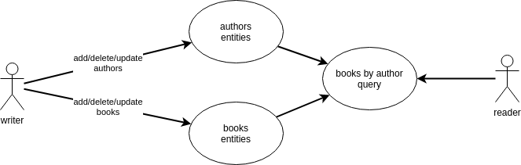
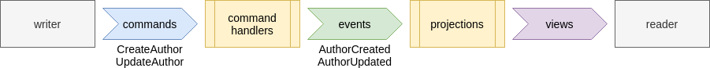
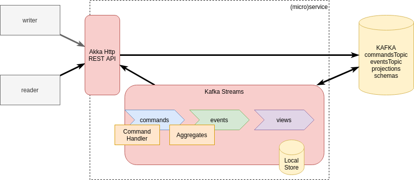

# Books Catalog Event Sourcing with Kafka Streams

Event driven/event sourcing microservice example written with:

- [Scala](https://scala-lang.org/)
- [Kafka Streams](https://kafka.apache.org/documentation/streams/)
    - [Kafka Streams - Interactive Queries](https://docs.confluent.io/current/streams/developer-guide/interactive-queries.html)
- [Akka Http](https://doc.akka.io/docs/akka-http/current/index.html)
- [Kaa Schema Registry](https://github.com/davideicardi/kaa)

## Patterns

- [Command Query Responsibility Segregation](https://docs.microsoft.com/en-us/azure/architecture/patterns/cqrs)
- [Event Driven](https://docs.microsoft.com/en-us/azure/architecture/guide/architecture-styles/event-driven)
- [Domain Driven Design](https://martinfowler.com/bliki/DomainDrivenDesign.html)
- [Event Sourcing](https://docs.microsoft.com/en-us/azure/architecture/patterns/event-sourcing)

## Domain Model

In this example I want to implement a very simple books catalog, when the user insert a list of authors, a list of books and can query the books for a specific author:



NOTE: For the current model this is for sure an over-kill architecture, but the idea is just to keep the model simple for demostration purpose.

## Logical Architecture




## Technical Architecture



## Microservices

This example can be used as a template for a service/microservice.

One important aspect to note is that each microservice should expose a public "interface" to the rest of the world.
In this case the public interace is composed by:
- **REST Api**
    - get author
    - create author
    - get all authors
    - ...
- **Kafka topics**
    - events
    - snapshots

Other microservice should just rely on this public interface. Potentially the implementation can change,
we can use another technology instead of Kafka Streams, but the public interface can remain the same.

## Why?

Why CQRS?
- Write and read models not always are the same
- Multiple/optimized read models
- Number of reads != number of writes

Why Event Driven?
- Allow to react to internal or external events (extensibility)
- Real time architecture

Why Event Sourcing?
- Consistency and reliability
- Events are the single source of truth
- Business logic separation
- Adding projections easily
- Schema evolution can be a little easier (but always a pain!)
- Dedicated storage can be added if needed for a specific projection (Elasticsearch, MongoDb, Cassandra, ...)
- Easy auditing/replay of events

Why JVM?
- The official implementation of Kafka Streams is available only for Java

Why Scala?
- It supports Java but with a functional approach and less verbose

Why Kafka?
- Fast, scalable and reliable storage
- It can be used for both storage and message bus (Reduce infrastructure components)

Why Kafka Streams?
- Scalable (each instance works on a set of partition)
- Event driven architecture are very hard to implement, Kafka Streams makes it a little less harder
- "Easy" [exactly-once](https://www.confluent.io/blog/enabling-exactly-once-kafka-streams/) semantic with Kafka
- Advanced stream processing capabilities (join, aggregates, ...)
- disadvantages:
    - quite hard to find good examples
    - reset state can be difficult

Why Akka Http?
- Good framework for REST API with a rich ecosystem (Akka, Akka Stream, Alpakka, ...)
- We can use Akka also for Kafka ingestion and for distribution, see [Alpakka](https://doc.akka.io/docs/alpakka/current/index.html))
- Akka Stream can substitute Kafka Streams in certain scenarios

Why AVRO?
- Fast and compact serialization format

Why Kaa Schema Registry?
- Simple [schema registry](https://medium.com/slalom-technology/introduction-to-schema-registry-in-kafka-915ccf06b902) library with Kafka persistence


## Usage

Requirements:
- scala sbt
- OpenJDK 11 (64 bit)
- Docker (for integrations tests)
    - Docker-compose

Run unit tests:

```
sbt test
```

Run the sample app:

```
sbt sample/run
```

HTTP RPC style API are available at: http://localhost:9081/

- `GET /authors/all` - gel all authors
- `GET /authors/one/{code}` - gel one author
- `POST /authors/create` - create an author
    - request body: `CreateAuthor` as json
    - response body: event
- `POST /authors/update/{code}` - update an author
    - request body: `UpdateAuthor` as json
    - response body: event
- `POST /authors/delete/{code}` - delete an author
    - request body: `DeleteAuthor` as json
    - response body: event

## TODO

- create topics at startup with correct properties (compact, retention, ...) 
- extract common code
- review TODO/println
- test with multiple partitions/instances
- add books

## Credits

Inspired by:

- Event Sourcing with Kafka Stream:
    - https://github.com/amitayh/event-sourcing-kafka-streams
    - https://speakerdeck.com/amitayh/building-event-sourced-systems-with-kafka-streams
- Kafka Streams Interactive Queries with Akka Http:
    - https://sachabarbs.wordpress.com/2019/05/08/kafkastreams-interactive-queries/

